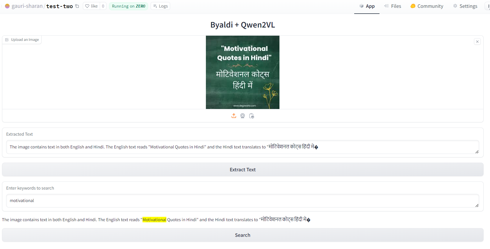

Check out the configuration reference at https://huggingface.co/docs/hub/spaces-config-reference

# Byaldi + Qwen2VL



## Overview

The **Byaldi + Qwen2VL** app is an innovative tool designed for extracting text from images using advanced OCR (Optical Character Recognition) techniques and natural language processing. This application leverages the **RAGMultiModalModel** from Byaldi and the **Qwen2VL** model for generating meaningful responses based on the extracted text. 

This application also takes advantage of **ZeroGPU** to run efficiently on powerful hardware, specifically the **NVIDIA A100** GPU, ensuring high-speed processing and accurate results even for large and complex image inputs.

## Features

- **Image Upload**: Users can upload images from which text will be extracted.
- **Text Extraction**: Utilizes state-of-the-art models to accurately extract text from the uploaded images.
- **Keyword Search**: Allows users to search for specific keywords within the extracted text and highlights them.
- **High-Performance**: Runs on **ZeroGPU (NVIDIA A100)** for accelerated computation and efficient model execution.
- **User-Friendly Interface**: Built using Gradio for an interactive user experience.

## Technologies Used

- **Gradio**: For creating the web interface.
- **Byaldi RAGMultiModalModel**: For indexing and searching images.
- **Qwen2VL**: For generating responses based on visual and textual inputs.
- **ZeroGPU**: For efficient model inference using **NVIDIA A100**.
- **PyTorch**: For deep learning functionalities.
- **Pillow**: For image handling.

## Getting Started

### Prerequisites

- Python 3.8 or later
- Required libraries:
  ```bash
  pip install gradio byaldi transformers torch pillow
## Installation
1. Clone the repository:
   ```bash
   git clone <repository-url>
   cd <repository-directory>

2. Install the required dependencies using pip.

3. Run the application:
   ```bash
   python app.py
### Using the App
1. **Upload an Image**: Click on the "Upload an Image" button to select and upload an image containing text.
2. **Extract Text**: Press the "Extract Text" button to process the image and extract any text found.
3. **Search Keywords**: Enter keywords in the search box and click "Search" to highlight matching keywords in the extracted text.
## Code Overview
The core functionality of the application is encapsulated in the following sections:
- **OCR and Text Extraction**:
  - The `ocr_and_extract` function processes the uploaded image, extracts text, and cleans the output to remove unnecessary labels.
- **Keyword Highlighting**:
  - The `search_keywords` function takes the extracted text and user-defined keywords, highlighting matches within the text for better visibility.
## ZeroGPU Integration
The application is powered by **ZeroGPU**, leveraging the **NVIDIA A100** GPU. This ensures:
- Faster image processing and text extraction.
- Seamless handling of large-scale models like Qwen2VL.
- Optimal performance during high computational loads.
## Error Handling
The application includes basic error handling to capture and display any issues encountered during image processing. Errors will be printed to the console, and a user-friendly message will be displayed in the interface.
## References
- [Byaldi](https://huggingface.co/vidore/colpali) for providing the RAGMultiModalModel.
- [Hugging Face Transformers](https://huggingface.co/docs/transformers/index) for state-of-the-art models.
- [ZeroGPU](https://www.zerogpu.com) for enabling efficient GPU computation with NVIDIA A100.
